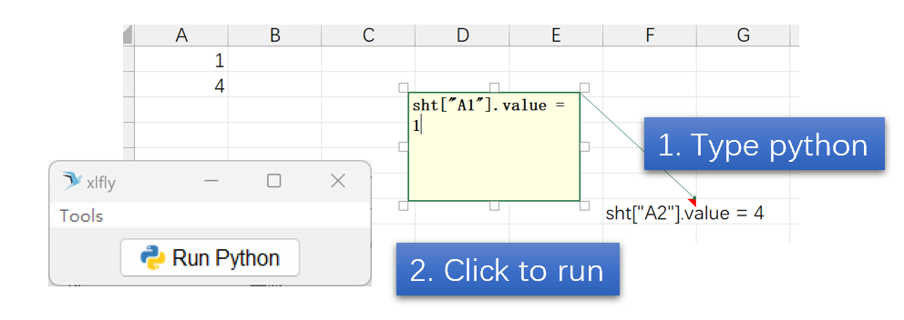
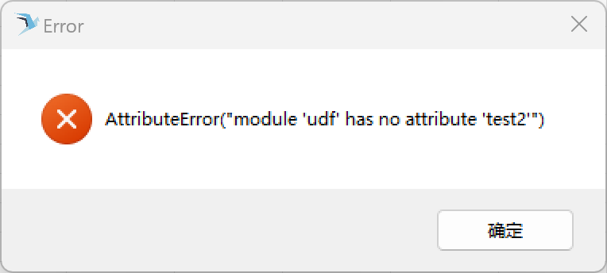

# xlfly - separate GUI based Excel tools

I love xlwings! However, I have noticed it very difficult to handle heavy calculations if using user defined functions. Hence xlfly: making using UDF easier. I chose separate GUI so that I can run parallel threads easier. 

## Usage



This package only works on Windows

1. Write python commands in Excel cells. Select it, click to run!
2. Write python in **commments** section in Excel. Select it, and click to run!


Create Windows Start Menu Item:

```bash
>>> xly --init
```

Excel selection to "Run Python"
1. Write python expressions in the cells
2. Select the cell with python scripts
3. Click "Run Python" button


I used the icon from https://www.iconfinder.com/search?q=wings&price=free drawn by Monsieur Steven Ankri. Thanks!

## PythonPath

When run python, both `current workbook` and `script_path` setting from setting page will be added to pythonpath. You can put your draft python script file in the same folder as current Excel file to debug.

## Debug

To debug the scripts in Excel, put the following header to your script:

```python
import xlwings as xw
import pandas as pd
import xlfly.copyover
```

script of the same name from Excel file folder will be imported first. 

- Thus you can debug by putting the scripts in the Excel folder
- Once done, move the file to the python path specified in the config page


Error messages will be thrown out:

