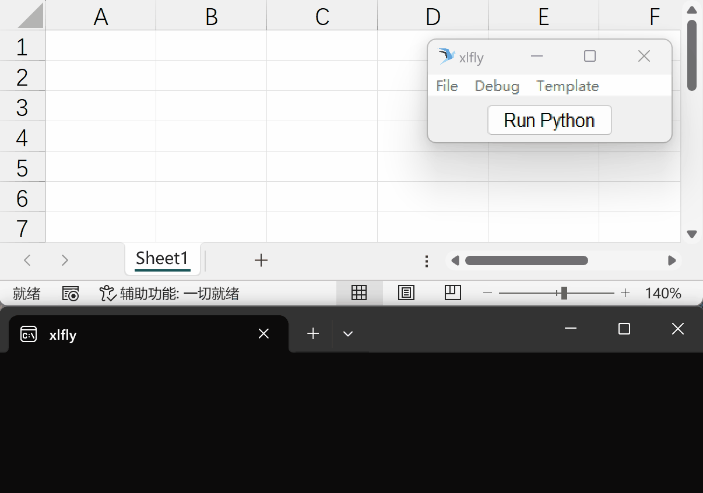

# xlfly - Excel Python hack for non-programmers

How to make non-programmers using python to hack Excel? Jupyter, python IDE, VS Code is not an option. With xlfly, you can deploy user friendly hack tool that makes the installation a breeze, usage intuitive, and your development stay in your comfort zone like VS Code.

Note: the author is from manufacturing industry where Excel is heavily used to do daily data processing and customer data report. Most people aournd me knows nothing about python, but craving for a handy tool. 

## Usage for non-programmers

### Install

If you are installed multiple pythons in your windows platform, you can use:

`py -3.12 -m pip config set global.index-url https://pypi.org/simple`
`py -3.12 -m pip install xlfly`
`py -3.12 -m xlfly.scripts --init -t path\to\template\folder`

### Usage

Fire up an Excel, write python commands in a cell or comments, select it, click "Run Python" to execute!

## Developers

### xlfly config page

To condition your python environment, you shall add a "xlfly" sheet to specify the conditions. You can add it with "File -> Add Config Page" in the menu. This sheet has:

1. **script_path**: the path to inclue your own module. 
2. **pre_cmd**: the command to run before executing user's command. I usually put `import` commands here
3. **requirements**: python packages to install for this Excel. It follows pip's requirements.txt syntax. Thus you can write `pandas>=2.0.0`.

### PythonPath

When run python, both `current workbook` and `script_path` setting from setting page will be added to pythonpath. 

Current workbook's path module will be loaded first. Such behavior is useful when you need to develop a script and then deploy to a shared server.

### Magic commands

* self.run_cell()

    Run multiple cells with a command

    Example:`self.run_cell(sht["A1:A5"])`

* xw.Range.to_link()

    Convert the range to link texts values. It is used for cases where you want to preserve the link to update the data in the future. Useful if you got data from another Excel file, and that file changes.

### Debug

To debug the scripts in Excel, run the menu: tools > create debug script. There will be a debug.py file to the same folder as current Excel file. You can start from there to debug

## Templates

How to deploy Excel templates in a corporate environment? I think a shared path to store scripts, while Excel file download to user is easiest.

Specify a template root path (most likely a shared path) to have all subfolders as options in the "templates > choose template" menu. Once selected, the main() function in the __init__.py file in that subfolder will be executed to initialize the template.

UDF VBA functions - sometimes users wants to have functions they can directly use in the Excel cells. In that case, it is recommended to write *.xlam files with UDF inside, then move it to the user addin directory. Such copy file over operation can be done with xlfly.move_addin() function

### default folder

Within template folder, you can add "default" subfolder to pythonpath by default, and the default.py file will be imported automatically. This is useful if you want to create Excel use cases where user can work on an empty Excel file without installing anything or making changes to Excel file

When installing xlfly, the `template_root_folder/default/__init__:setup()` will be executed. 

## Others

Icon is from [Icon Finder](https://www.iconfinder.com/icons/2785363/blockchain_wings_icon) by Monsieur Steven Ankri.